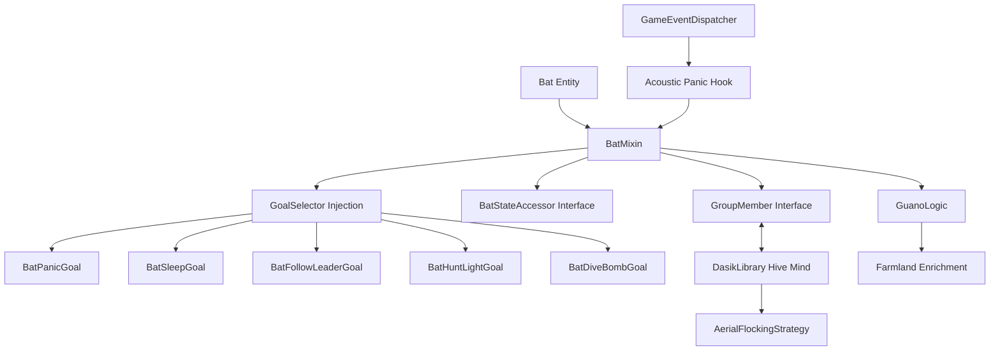

# Better Bats Architecture

## System Overview

Better Bats overhauls the vanilla `Bat` entity by injecting custom AI goals and social behaviors via Mixins. It relies heavily on **DasikLibrary**'s Hive Mind API for group synchronization.

## Module Responsibilities

### 1. The Hive Mind (Flocking)
Bats implement the `GroupMember` interface. The `BatFollowLeaderGoal` allows them to dynamically find a leader within 16 blocks. When following, the vanilla erratic flight logic is bypassed in favor of the `AerialFlockingStrategy`, which uses cohesion, alignment, and separation vectors to create smooth swarm movements.

### 2. Guano Roosts
When a bat is in the `resting` state (upside down), a `guano_ticks` counter increments. After 12,000 ticks (approx. 10 minutes), the bat "drops" guano. The logic scans up to 20 blocks below for `FarmlandBlock`. If found, it applies a bone meal effect to the crop above it.

### 3. Phototaxis (Light Hunting)
The `BatHuntLightGoal` scans for light sources with a block brightness > 12. If found, the bat breaks from its flock to circle the light, spawning `CRIT` particles to simulate feeding on insects attracted to the glow.

### 4. Acoustic Panic
A global hook into `GameEventDispatcher` listens for loud events like `EXPLODE`, `BLOCK_DESTROY`, or sprinting players (`STEP`). Any bat within 16 blocks is sent into a panic state via `BatStateAccessor`. Resting bats are immediately awoken, their guano timers are reset to 0, and they execute the `BatPanicGoal` to fly at high speed away from the noise source while playing takeoff and phantom flap sounds.

## Design Decisions
- **Mixin Accessors**: Used `MobAccessor` to bypass protected access to `goalSelector`.
- **NBT Persistence**: Guano ticks are stored using the Snapshot 26.1 `ValueOutput`/`ValueInput` system for compatibility.
- **Performance**: Flocking updates are staggered based on entity ID to prevent TPS spikes.
